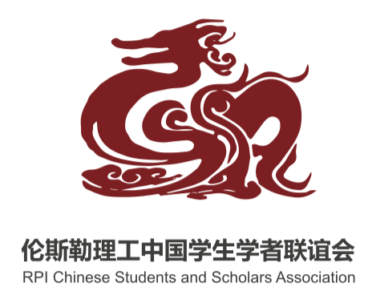

# RPI中国学生学者联谊会 ( CSSA )

## 关于我们

RPI中国学生学者联谊会(RPIChinese Students & Scholars Association, 简称RPI CSSA) 是在RPI学生 联盟(Student Union) 的支持和资助下由广大RPI中国学生成 立了。 CSSA 是RPI非盈利性的学生组织和团体, 服务于 RPI的 所有华人学生和学者(大部分会员为来自中国大陆的本科生, 研究生，博士生以及各类交换学生和访问学者，也有港澳同 胞，台湾同胞), 以及其他对于中国文化感兴趣而加入 CSSA 的外国朋友。

对于许多新来的中国大陆学生和学者来说， CSSA 是大家温暖的家，因为 CSSA为新生解答疑惑，提供机场迎接，帮助 找房及提供其他重要的信息服务。CSSA通常组织的活动有迎 新烧烤BBQ,，K歌大赛，中秋和春节大型联欢晚会，社团集 体购物旅行，华人篮球赛，足球赛，DOTA, LOL联赛和游戏 派对等等。

为了更好地为广大中国学生学者服务,发挥好窗口和桥梁作 用，CSSA 建立了比较完善的组织机构,并且在每年11月份进 行换届选举。学生会由文艺部，体育部，外联部，宣传部， 财务部五大部门组成。学生会的运作管理基本按照主席，副 主席，秘书长各一名，各部门主席，负责人若干的组织结构 来进行招募和工作分配。

## 活动资源

RPI CSSA 跟RPI 校内各类社团和学生组织有着广泛的合作与 联系，同时与纽约首府周边地区的其他兄弟院校如SUNY Albany, Union College 中国学生会组织和大首都地区华人社 团, 以及公益教会组织等都有着长期友好的交流合作关系。 如果需要进一步了解的相关信息及活动计划可以直接访问的 官方主页，其中有我们管理人员的简介和联系方式，同时也 收录了许多过去大型活动的相册、视频，更有许多历史活动 的珍贵信息可以找到。

 

## 加入我们

作为一个初来乍到的新生，如何加入RPI CSSA 成为一名正式 的会员，从而能够在以后的活动和交流中享受到作为正式会 员应有的折扣，福利和获奖的机会，请特别注意以下的内容 和遵循下列顺序按部就班地成为RPI CSSA 的正式会员:

1. 注册成为RPI CSSA 官方成员 要注册成为RPI CSSA 的官方正式会员，您必须要提供您的姓名、性别、RIN Number (e.g. 660537674) 以及RCS ID (通常激活后得到)。 因此,请务必在到校注册并开通激活校内邮 箱之后,将您的上述信息（姓名、性别、RIN 和邮箱）在RPI CSSA 官网提交，这样管理员才能将有效信息放入学校Student Union 的官方系统，让您成为一名正式的注册会员。

2. 通过Activity Fair注册 每年秋季入学之后学校会组织一次Activity Fair 便于各个社 团的招募，CSSA 在现场也会有展位。大家可以踊跃选择自 己感兴趣的社团，CSSA 期待大家找到我们并加入！

3. 加入和关注CSSA 社交页面 RPI CSSA Google Group Mailing List: http://groups.google.com/group/rpi_cssa

4. 关注我们的微信公众号：RPICSSA 学生会的大部分信息都会通过微信公众号来发布，同时这也 是一个学生可以和学生会交流的平台，所有学生的问题都可 以留言，由管理员看到之后统一回复。微信公众平台会定时 发布学生会将组织的活动以及活动总结等信息。当学生会的 赞助商为学生提供福利的时候（例如租房， 暑校， 节日等 等），学生也可以从微信公众平台获得第一手的信息。这里 请特别注意,新生请在抵达学校前关注，我们会提供接机服务 以及新生抵达攻略。

